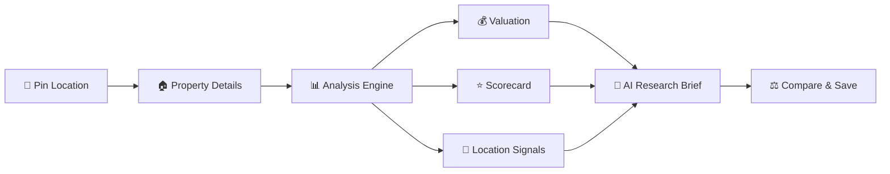

# 🏡 PropWise AI

### AI-Powered Real Estate Location Intelligence Platform

<p align="center">

📍 **Pin Location** → 📊 **Analyze Property** → 🤖 **AI Insights** → ⚖️ **Compare** → 💾 **Save**

</p>

<p align="center">


</p>

---

## 🚀 Overview

**PropWise AI** is a full-stack real-estate research workspace that helps users evaluate land and property locations using:

* 📍 Interactive map-based analysis
* 💰 Indicative property valuation
* 📊 Property scorecard
* 🤖 AI-generated research brief
* ⚖️ Property comparison
* 💾 Saved analyses
* 🧩 Chrome Extension for listing extraction

> **Note:** PropWise provides model-based estimates for early-stage research. It is **not** a professional valuation, legal verification, financial advice, or government-record verification system.

---

## ✨ Features

| Feature              | Description                                         |
| -------------------- | --------------------------------------------------- |
| 📍 Location Analysis | Pin and analyze a property location                 |
| 💰 Valuation         | Estimate total value and ₹/sq.ft                    |
| 📊 Scorecard         | Evaluate accessibility, location and growth factors |
| 🤖 AI Brief          | Generate research guidance and risk insights        |
| ⚖️ Compare           | Compare shortlisted properties                      |
| 💾 Save              | Store property analyses                             |
| 🧩 Extension         | Extract visible listing information                 |

---

## 🧠 How It Works



---

## 🏗️ Tech Stack

```text
Frontend       → React + TypeScript + Vite + Tailwind
Backend        → Node.js + Express + tRPC
Database       → MySQL / TiDB
ORM            → Drizzle ORM
Authentication → Manus OAuth
AI             → Server-side Built-in LLM
Maps           → Google Maps Proxy
Charts         → Recharts
Extension      → Chrome Manifest V3
```

---

## 📂 Project Structure

```text
PropWise-AI/
│
├── client/              # React frontend
├── server/              # Express + tRPC backend
├── drizzle/             # Database schema & migrations
├── chrome-extension/    # Manifest V3 extension
├── dataset/             # Dataset documentation
├── docs/                # Technical documentation
└── tests/               # Tests
```

---

## 🧩 Chrome Extension

The Manifest V3 extension extracts **visible listing information** from supported property websites and sends it to the PropWise workspace.

```text
Property Website
       ↓
Chrome Extension
       ↓
Extract Listing Data
       ↓
PropWise AI
       ↓
Property Analysis
```

### Install

```text
1. Open chrome://extensions
2. Enable Developer Mode
3. Click "Load unpacked"
4. Select chrome-extension/
```

---

## ⚙️ Run Locally

### Install

```bash
pnpm install
```

### Development

```bash
pnpm dev
```

### Check

```bash
pnpm check
```

### Test

```bash
pnpm test
```

### Build

```bash
pnpm build
```

---

## 📊 Example Output

```text
Estimated Value       ₹42,50,000
Price / sq.ft         ₹1,770
Indicative Range      ₹36L – ₹49L
Investment Score      82 / 100
Area Classification   Urban
Accessibility         Good
```

> Values are indicative development-model estimates and should not be treated as professional property valuations.

---

## 🛣️ Roadmap

* [x] Interactive property map
* [x] Indicative valuation
* [x] Property scorecard
* [x] AI research brief
* [x] Save & compare
* [x] Chrome Extension
* [ ] More listing website adapters
* [ ] Licensed property dataset
* [ ] Comparable-property analysis
* [ ] Model calibration
* [ ] Advanced location intelligence

---

## ⭐ Support

If you like **PropWise AI**, consider giving the repository a ⭐

**Research smarter. Compare better. Decide with evidence.**

---

