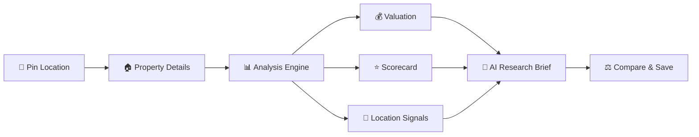

# 🏡 PropWise AI

### AI-Powered Real Estate Location Intelligence Platform

<p align="center">

📍 **Pin Location** → 📊 **Analyze Property** → 🤖 **AI Insights** → ⚖️ **Compare** → 💾 **Save**

</p>

<p align="center">


</p>

---

## 🚀 Overview

**PropWise AI** is a full-stack real-estate research workspace that helps users evaluate land and property locations using:

* 📍 Interactive map-based analysis
* 💰 Indicative property valuation
* 📊 Property scorecard
* 🤖 AI-generated research brief
* ⚖️ Property comparison
* 💾 Saved analyses
* 🧩 Chrome Extension for listing extraction

> **Note:** PropWise provides model-based estimates for early-stage research. It is **not** a professional valuation, legal verification, financial advice, or government-record verification system.

---

## ✨ Features

| Feature              | Description                                         |
| -------------------- | --------------------------------------------------- |
| 📍 Location Analysis | Pin and analyze a property location                 |
| 💰 Valuation         | Estimate total value and ₹/sq.ft                    |
| 📊 Scorecard         | Evaluate accessibility, location and growth factors |
| 🤖 AI Brief          | Generate research guidance and risk insights        |
| ⚖️ Compare           | Compare shortlisted properties                      |
| 💾 Save              | Store property analyses                             |
| 🧩 Extension         | Extract visible listing information                 |

---

## 🧠 How It Works



---

## 🛠️ Tech Stack

### 🎨 Frontend

<p>
  
  
  
  
  
</p>

**React • TypeScript • Vite • Tailwind CSS • Recharts**

Used for building the responsive property-analysis dashboard, interactive forms, scorecards, charts, and map-based workspace.

---

### ⚙️ Backend

<p>
  
  
  
  
</p>

**Node.js • Express • tRPC • Drizzle ORM**

Provides type-safe APIs, property analysis services, authentication handling, valuation logic, and database operations.

---

### 🗄️ Database

<p>
  
  
</p>

**MySQL / TiDB-compatible Database**

Stores:

* 👤 Users
* 📍 Locations
* 🏠 Properties
* 📊 Analyses
* ⭐ Scorecards
* ⚖️ Comparisons

---

### 🤖 AI & Intelligence

<p>
  
  
  
</p>

**Server-side LLM • Structured AI Analysis • Research Guidance**

AI is used to generate:

* 🔎 Property research briefs
* ⚠️ Risk signals
* 📈 Future considerations
* 🧠 Research recommendations
* 📋 Due-diligence guidance

> AI outputs are presented as research assistance and do not represent professional valuation or legal verification.

---

### 🗺️ Maps & Location Intelligence

<p>
  
  
</p>

**Google Maps • Location Coordinates • Geographic Analysis**

Used for:

```text
📍 Location Pinning
🗺️ Interactive Maps
📌 Latitude / Longitude
🏙️ Area Classification
```

---

### 🧩 Chrome Extension

<p>
  
  
</p>

**Chrome Manifest V3 • Content Scripts • Background Service Worker**

The extension extracts visible listing information from supported property websites and sends it to the PropWise workspace.

```text
Property Website
      ↓
Content Script
      ↓
Listing Extraction
      ↓
Data Normalization
      ↓
PropWise Workspace
```

---

### 🔐 Authentication & Security

**Manus OAuth • Secure Sessions • Environment Variables • Input Validation**

Security principles:

```text
🔐 OAuth Authentication
🛡️ Server-side API Access
🔑 Protected Credentials
✅ Input Validation
🚫 No API Keys in Browser
🚫 No API Keys in Extension
```

---

### 🧪 Testing & Quality

<p>
  
  
</p>

**Vitest • TypeScript Validation • Unit Testing**

```bash
pnpm check
pnpm test
pnpm build
```

---

### 🚀 Development & Deployment

**pnpm • Git • Managed Hosting • Environment Variables**

```text
Development
    ↓
TypeScript Check
    ↓
Unit Tests
    ↓
Production Build
    ↓
Deployment
```

---

### 📦 Complete Stack

```text
┌──────────────────────────────────────────────┐
│                  PROPWlSE AI                 │
├──────────────────────────────────────────────┤
│                                              │
│ 🎨 Frontend                                  │
│ React • TypeScript • Vite • Tailwind         │
│                                              │
│ ⚙️ Backend                                   │
│ Node.js • Express • tRPC • Drizzle           │
│                                              │
│ 🗄️ Database                                  │
│ MySQL / TiDB                                 │
│                                              │
│ 🤖 AI                                        │
│ Server-side LLM • AI Research                │
│                                              │
│ 🗺️ Location Intelligence                    │
│ Google Maps • Geographic Analysis            │
│                                              │
│ 🧩 Browser Intelligence                      │
│ Chrome Manifest V3                           │
│                                              │
│ 🔐 Authentication                             │
│ Manus OAuth • Secure Sessions                │
│                                              │
│ 🧪 Testing                                   │
│ Vitest • TypeScript Validation               │
│                                              │
└──────────────────────────────────────────────┘
```

---

## 📂 Project Structure

```text
PropWise-AI/
│
├── client/              # React frontend
├── server/              # Express + tRPC backend
├── drizzle/             # Database schema & migrations
├── chrome-extension/    # Manifest V3 extension
├── dataset/             # Dataset documentation
├── docs/                # Technical documentation
└── tests/               # Tests
```

---

## 🧩 Chrome Extension

The Manifest V3 extension extracts **visible listing information** from supported property websites and sends it to the PropWise workspace.

```text
Property Website
       ↓
Chrome Extension
       ↓
Extract Listing Data
       ↓
PropWise AI
       ↓
Property Analysis
```

### Install

```text
1. Open chrome://extensions
2. Enable Developer Mode
3. Click "Load unpacked"
4. Select chrome-extension/
```

---

## ⚙️ Run Locally

### Install

```bash
pnpm install
```

### Development

```bash
pnpm dev
```

### Check

```bash
pnpm check
```

### Test

```bash
pnpm test
```

### Build

```bash
pnpm build
```

---

## 📊 Example Output

```text
Estimated Value       ₹42,50,000
Price / sq.ft         ₹1,770
Indicative Range      ₹36L – ₹49L
Investment Score      82 / 100
Area Classification   Urban
Accessibility         Good
```

> Values are indicative development-model estimates and should not be treated as professional property valuations.

---

## 🛣️ Roadmap

* [x] Interactive property map
* [x] Indicative valuation
* [x] Property scorecard
* [x] AI research brief
* [x] Save & compare
* [x] Chrome Extension
* [ ] More listing website adapters
* [ ] Licensed property dataset
* [ ] Comparable-property analysis
* [ ] Model calibration
* [ ] Advanced location intelligence

---

## ⭐ Support

If you like **PropWise AI**, consider giving the repository a ⭐

**Research smarter. Compare better. Decide with evidence.**

---

