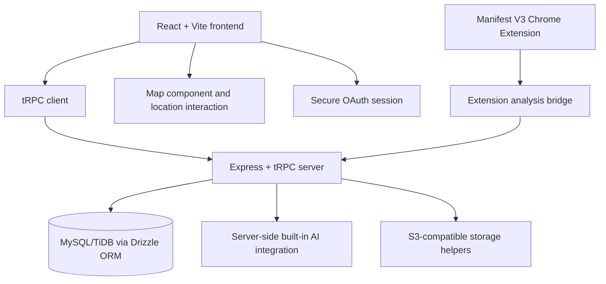

# PropWise AI

> **Map-first property intelligence for early-stage land and real-estate research.**

PropWise AI helps users investigate a property or land opportunity before making a decision. A user searches for a place or clicks the exact location on a map, enters the site details they know, and receives an explainable indicative analysis covering estimated value, price per square foot, location classification, access signals, investment score, future projection, risks, and questions to verify next.

The product is deliberately designed as a research aid rather than a professional valuation, title-search service, financial adviser, or government-record verification system.

## Product preview

The live project preview is available at:

**<https://3000-it4adxo49jd8n32233dwt-e2d1ec02.us4.manus.computer/>**

The public source repository is available at:

**<https://github.com/Iyyappan-S/propwise-ai>**

## Core capabilities

| Capability | Description |
| --- | --- |
| Exact map pinning | Search can center the map, but only an explicit user click on the map authorizes the price calculation coordinates. |
| Indicative valuation | Computes a transparent model estimate, estimated price per square foot, and an indicative range from entered site inputs. |
| Location scorecard | Presents area classification, access, demand, growth, and investment signals in a readable scorecard. |
| AI research advisor | Produces cautious, structured guidance and due-diligence prompts through a server-side AI integration. |
| Saved properties | Stores analyzed properties in a private shortlist for later review. |
| Comparison workspace | Compares two to four saved properties using score-based decision-support logic. |
| Analysis history | Preserves the research trail so earlier analyses can be revisited. |
| Responsive workspace | Provides a landing page, secure login flow, authenticated dashboard shell, mobile navigation, and responsive analysis pages. |
| Chrome Extension | Includes a Manifest V3 extension that extracts visible listing details and hands them to the PropWise workspace. |

## Why the exact pin matters

PropWise treats the manual map click as the authoritative location input. A searched address is provisional: it may update the visible address or center the map, but it does not satisfy the calculation requirement. The analysis action remains gated until the user clicks the exact site location. This keeps the location-dependent estimate tied to an explicit user decision rather than an unverified search result.

## Application flow

```mermaid
flowchart LR
    A[Landing page] --> B[Secure sign in]
    B --> C[Workspace dashboard]
    C --> D[Search or inspect a place]
    D --> E[Click exact map location]
    E --> F[Enter site details]
    F --> G[Run indicative analysis]
    G --> H[Review scorecard and AI notes]
    H --> I[Save property]
    I --> J[Compare shortlist or revisit history]
```



## Main routes

| Route | Purpose |
| --- | --- |
| `/` | Public landing page and product introduction. |
| `/login` | Dedicated secure sign-in page. |
| `/analyze` | Exact-pin analysis workflow and site input form. |
| `/saved` | Saved-property shortlist. |
| `/compare` | Select and compare two to four properties. |
| `/history` | Previously generated analyses. |
| `/profile` | Authenticated user profile view. |
| `/about` | Methodology, product boundaries, and limitations. |

Workspace routes require authentication through the project’s existing secure session flow.

## Technical architecture



### Repository structure

| Area | Location |
| --- | --- |
| Frontend application | `client/src/App.jsx`, `client/src/pages/`, `client/src/components/` |
| Global design system | `client/src/index.css` |
| Authenticated workspace shell | `client/src/components/DashboardLayout.jsx` |
| Backend procedures | `server/routers.js` |
| Database query helpers | `server/db.js` |
| Database schema and migrations | `drizzle/schema.ts`, `drizzle/migrations/` |
| Server infrastructure | `server/_core/` |
| Chrome Extension | `chrome-extension/` |
| Technical documentation | `docs/` |
| Dataset and model notes | `dataset/` |
| Automated tests | `server/*.test.js`, `tests/` |

## Technology stack

The application uses React, Vite, Tailwind CSS, Express, tRPC, Drizzle ORM, MySQL/TiDB-compatible persistence, Manus OAuth, Recharts, Lucide icons, and the project’s proxied map integration. The Chrome Extension uses Manifest V3 with a popup, content extractor, background service worker, options page, and store-oriented metadata.

## JavaScript-first codebase

Approximately 80% or more of the custom application source is now JavaScript/JSX. Frontend pages, reusable UI components, hooks, tRPC client bindings, backend procedures, database helpers, shared utilities, and tests use `.js` or `.jsx`. The remaining TypeScript files are limited primarily to the scaffold’s server infrastructure and the database schema types that support the authentication and runtime boundary. This keeps the product code approachable for JavaScript developers without rewriting stable framework plumbing.

## Local development

### Prerequisites

Install Node.js, pnpm, and a MySQL/TiDB-compatible database. The managed project normally supplies authentication, database, built-in API, storage, and map-related environment variables through the project runtime.

### Installation

```bash
git clone https://github.com/Iyyappan-S/propwise-ai.git
cd propwise-ai
pnpm install
```

For an external environment, copy the provided non-secret template and supply the required values through your deployment platform rather than committing secrets:

```bash
cp server/.env.example .env
```

### Run the development server

```bash
pnpm dev
```

### Validate the project

```bash
pnpm check
pnpm test
pnpm build
```

The project uses Vitest for automated checks. The suite covers core authentication behavior, analysis logic, comparison validation, and repository-level contracts for the frontend and extension surfaces.

## Database workflow

The project follows a schema-first workflow:

```bash
pnpm drizzle-kit generate
```

Review the generated migration before applying it. In the managed environment, database migrations are applied through the project database workflow. Do not use destructive SQL against production data without a verified backup and an explicit migration plan.

## Chrome Extension

The extension source is under `chrome-extension/`. It is a Manifest V3 package with this flow:

1. The content extractor reads visible listing details from a supported page.
2. The background service worker coordinates extraction, context-menu actions, and storage.
3. The popup presents extracted details and requests an indicative PropWise analysis.
4. The user can open the full workspace for deeper analysis, saving, and comparison.

To load it locally in Chrome:

1. Open `chrome://extensions`.
2. Enable **Developer mode**.
3. Select **Load unpacked**.
4. Choose the repository’s `chrome-extension/` directory.
5. Open a supported listing page and use the extension popup or context-menu action.

The Chrome Web Store listing materials, privacy notes, permission explanations, icons, and screenshots are documented in `chrome-extension/store-listing.md` and `chrome-extension/README.md`.

## AI and valuation boundaries

PropWise uses a transparent development valuation model and a server-side AI explanation layer. The output is intentionally labeled **indicative**. It should not be treated as a guaranteed market price, professional appraisal, investment recommendation, title opinion, zoning confirmation, tax determination, or inspection report.

Users should independently verify ownership, title, encumbrances, zoning, land use, permits, approvals, road rights, utilities, taxes, environmental conditions, flood risk, survey boundaries, construction quality, and current comparable evidence before acting.

Nearby-facility and location signals may use development heuristics or configured data sources. They must be calibrated and independently verified before being treated as production-grade market intelligence.

## Security and privacy

The application keeps AI credentials server-side and does not expose provider keys to the browser or extension. Authentication uses the project’s secure OAuth/session flow. Real credentials must be supplied through environment configuration or the deployment platform’s secret manager; never commit `.env` files, API keys, session secrets, or database credentials.

## Deployment

The project is designed for the managed WebDev runtime. Before publishing:

1. Confirm the database schema and migration are synchronized.
2. Configure required secrets through the project settings.
3. Run `pnpm check`, `pnpm test`, and `pnpm build`.
4. Review authentication redirects, map configuration, AI fallbacks, and storage behavior.
5. Create a project checkpoint.
6. Use the project’s Publish workflow to deploy the verified checkpoint.

For external hosting, confirm compatibility with the project’s OAuth callback URLs, server runtime, database connection, storage configuration, and built-in API integrations.

## Project documentation

| Document | Purpose |
| --- | --- |
| `docs/demo.md` | Guided website demo, live preview URL, route walkthrough, and exact-pin explanation. |
| `docs/architecture.md` | Architecture, API, database, ML, AI, extension, data-flow, and deployment notes. |
| `docs/environment.md` | Environment and deployment configuration guidance. |
| `docs/env.example` | Non-secret environment placeholder list. |
| `dataset/README.md` | Dataset policy, licensing expectations, synthetic-data separation, and model limitations. |
| `chrome-extension/store-listing.md` | Chrome Web Store listing copy, permissions, privacy disclosure, and publication checklist. |

## License

Add the project’s chosen license before public redistribution. Until a license file is added, all rights remain with the copyright holder and repository owner.

## References

[1]: https://react.dev/ "React documentation"
[2]: https://vite.dev/ "Vite documentation"
[3]: https://trpc.io/ "tRPC documentation"
[4]: https://orm.drizzle.team/ "Drizzle ORM documentation"
[5]: https://developer.chrome.com/docs/extensions/ "Chrome Extensions documentation"
[6]: https://docs.github.com/en/repositories/creating-and-managing-repositories/about-repositories "GitHub repository documentation"
