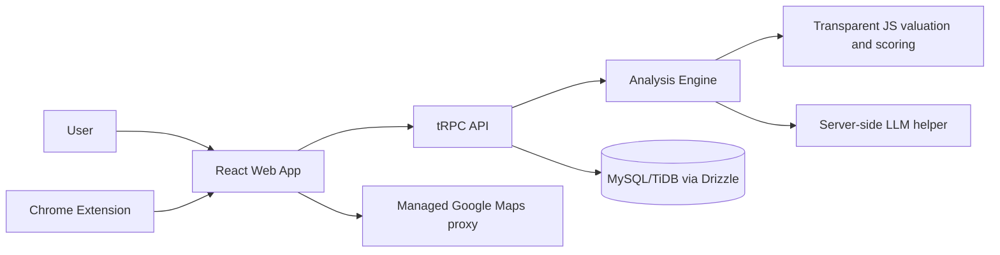
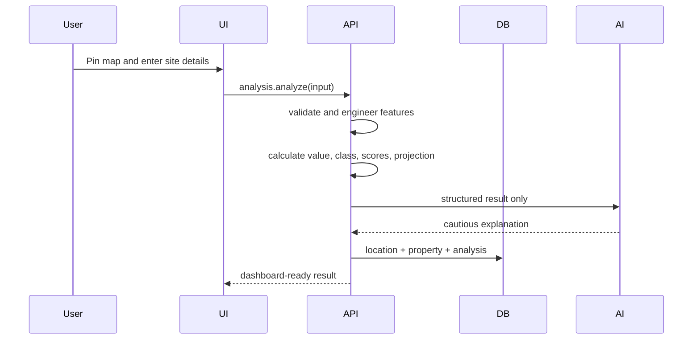
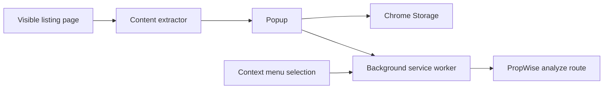

# PropWise AI architecture

## System architecture

## Data flow

## Database model

`users` is the scaffold authentication table. `locations` stores coordinates and a transparent area class. `properties` stores the user’s site inputs. `analyses` stores the immutable result JSON for history. `savedProperties` attaches notes, tags, and favorites to a user’s property. `comparisons` stores selected property IDs and the recommendation text. Foreign-key constraints can be added when the deployment database’s migration policy is finalized.

## API surface

The application exposes typed tRPC procedures rather than handwritten REST handlers: `auth.me`, `auth.logout`, `analysis.analyze`, `analysis.history`, `properties.list`, `properties.get`, `saved.list`, `saved.add`, `saved.remove`, `comparison.analyze`, `ai.explain`, and `ml.predict`. Each protected procedure receives the authenticated user from the scaffold session context.

## ML and valuation methodology

The current engine is an explainable JavaScript development model. Features include latitude/longitude signals, category, area, road-access input, known amenity count, property age, and category-specific base rates. The output is a model prediction with an indicative ±7% range. Area classification is a rule-based signal with a confidence label. Location score weights are connectivity 25%, facilities 20%, development 20%, demand 15%, growth 10%, and a conservative unavailable-factor placeholder 10%.

No MAE, RMSE, or R² claims are reported because a representative licensed labeled dataset is not bundled. When one is available, add it under `dataset/raw/`, document the license, create a processed split, and implement a TensorFlow.js training/evaluation job without mixing synthetic and real records.

## AI boundaries

The server sends structured numerical results to the LLM helper. The prompt explicitly prohibits inventing price evidence, ownership, title status, approvals, government records, or legal conclusions. If the helper is unavailable, the server returns a deterministic fallback brief.

## Extension architecture

The extractor is intentionally generic and reads visible text only. It does not bypass protections or claim universal website support. Website adapters can be added under `chrome-extension/services/`.

## Deployment

The managed WebDev project runs the web application as a single Node process. The source is suitable for managed deployment after a final production build. External deployments should configure secrets through their platform, enable HTTPS, set CORS to the published frontend, and update the extension dashboard URL.
